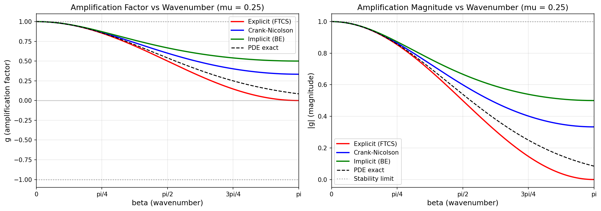
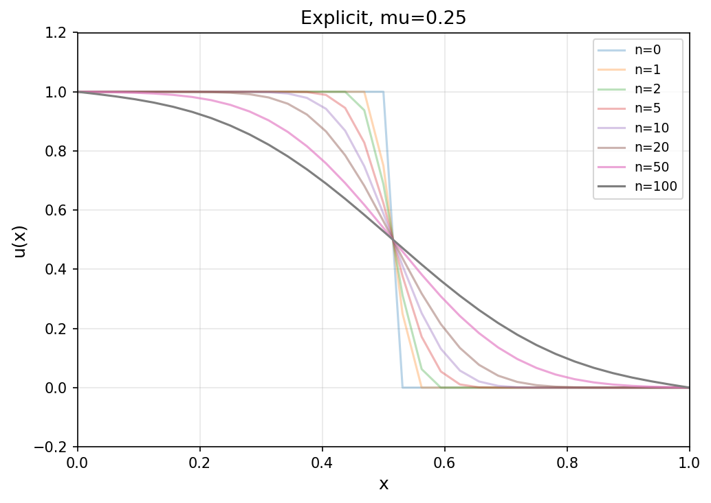
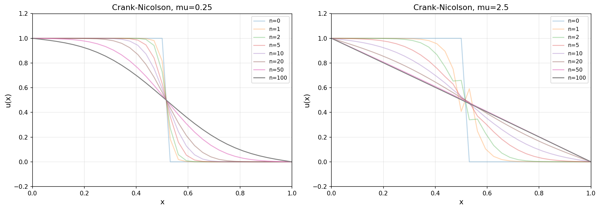
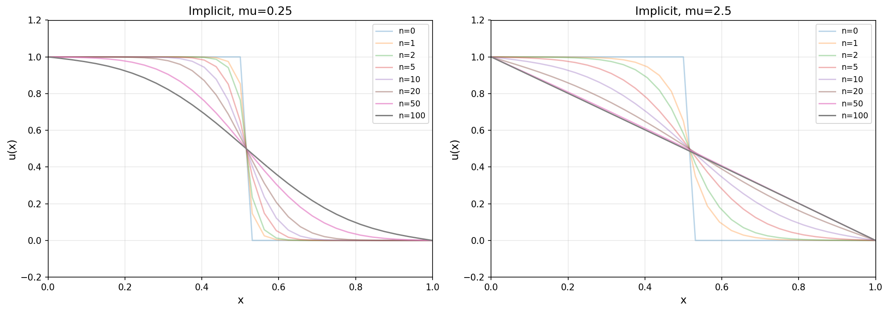
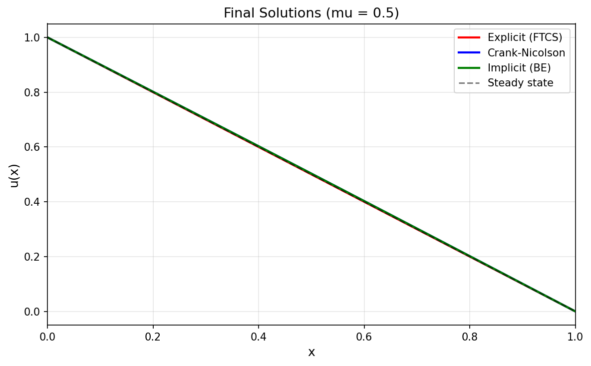
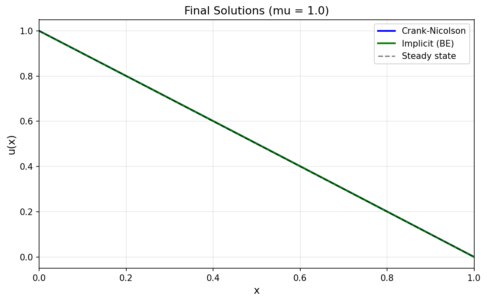
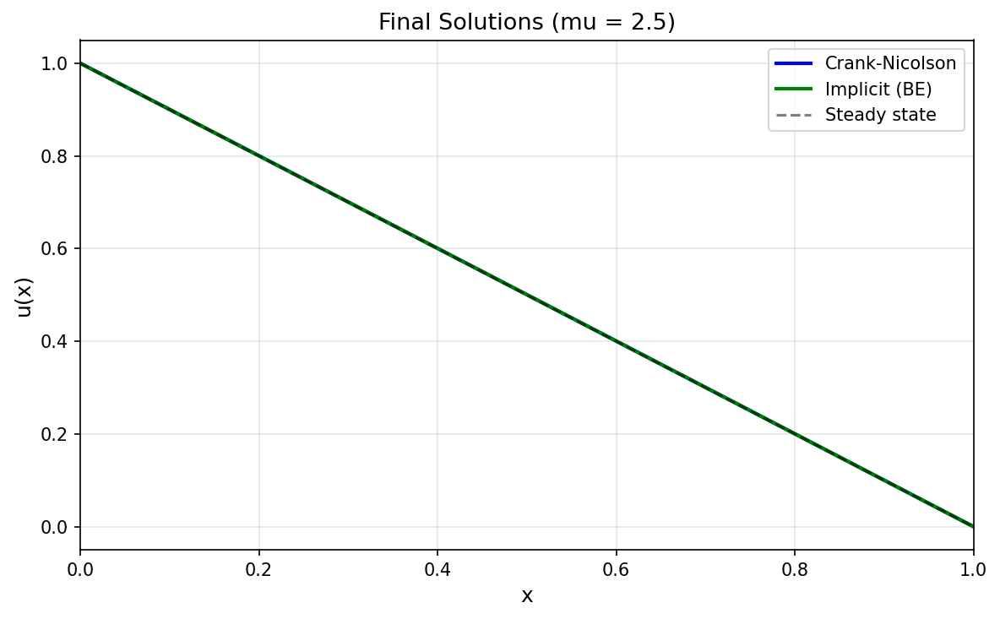
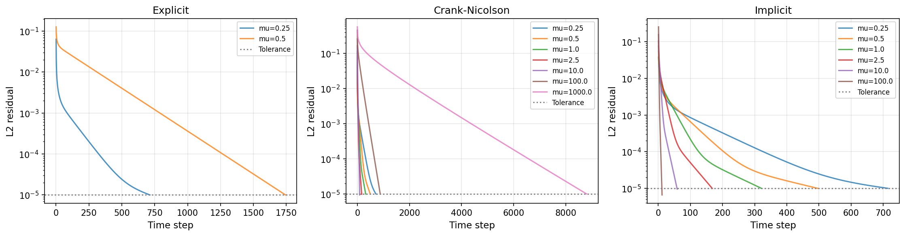

# 1D Heat Equation Solver Report
## Generalized Crank-Nicolson (Theta) Scheme
*Generated: 2025-12-13 23:48:49*

---

## Table of Contents
1. [Introduction](#introduction)
2. [Part A: Von Neumann Stability Analysis](#von-neumann-stability-analysis)
3. [Part B: Time-Marching Computations](#time-marching-computations)
4. [Convergence Results](#convergence-results)
5. [Conclusions](#conclusions)

---

## Introduction

This report presents the analysis and numerical solution of the 1D heat (diffusion) equation using the generalized Crank-Nicolson (theta) scheme.

### The Heat Equation

We solve the partial differential equation:

```
u_t = alpha * u_xx
```

where:
- `u(x,t)` is the temperature distribution
- `alpha` is the thermal diffusivity
- Subscripts denote partial derivatives

### The Theta Scheme

The generalized Crank-Nicolson discretization is:

```
(u_i^(n+1) - u_i^n)/dt = alpha * [
    theta * (u_(i+1)^(n+1) - 2*u_i^(n+1) + u_(i-1)^(n+1)) / dx^2
  + (1-theta) * (u_(i+1)^n - 2*u_i^n + u_(i-1)^n) / dx^2
]
```

Special cases:
- `theta = 0`: Explicit (FTCS) - Forward Time, Central Space
- `theta = 0.5`: Crank-Nicolson - second-order accurate
- `theta = 1`: Implicit (Backward Euler)

Key parameter: `mu = alpha * dt / dx^2` (mesh ratio / CFL number)

---

## Von Neumann Stability Analysis
### Amplification Factor Derivation
For the 1D heat equation `u_t = alpha * u_xx` discretized with the generalized Crank-Nicolson (theta) scheme:

```
(u_i^(n+1) - u_i^n)/dt = alpha * [
    theta * (u_(i+1)^(n+1) - 2*u_i^(n+1) + u_(i-1)^(n+1)) / dx^2
  + (1-theta) * (u_(i+1)^n - 2*u_i^n + u_(i-1)^n) / dx^2
]
```

Using Von Neumann analysis with Fourier mode `u_j^n = G^n * exp(i*j*beta)`,
the amplification factor is derived as:

```
s2 = sin^2(beta/2)
g(theta, mu, beta) = (1 - 4*(1-theta)*mu*s2) / (1 + 4*theta*mu*s2)
```

where:
- `mu = alpha * dt / dx^2` (mesh ratio)
- `beta` is the nondimensional wavenumber in `[0, pi]`
- `theta` (lambda) is the implicitness parameter

### Stability Results by Scheme

| Scheme | theta | mu | max|g| | min(g) | Stable? | Oscillatory? |
|--------|-------|-----|--------|--------|---------|---------------|
| Explicit (FTCS) | 0.0 | 0.25 | 1.0000 | 0.0000 | Yes | No |
| Explicit (FTCS) | 0.0 | 0.5 | 1.0000 | -1.0000 | Yes | Yes |
| Explicit (FTCS) | 0.0 | 1.0 | 3.0000 | -3.0000 | NO | Yes |
| Explicit (FTCS) | 0.0 | 2.5 | 9.0000 | -9.0000 | NO | Yes |
| Crank-Nicolson | 0.5 | 0.25 | 1.0000 | 0.3333 | Yes | No |
| Crank-Nicolson | 0.5 | 0.5 | 1.0000 | 0.0000 | Yes | No |
| Crank-Nicolson | 0.5 | 1.0 | 1.0000 | -0.3333 | Yes | Yes |
| Crank-Nicolson | 0.5 | 2.5 | 1.0000 | -0.6667 | Yes | Yes |
| Implicit (BE) | 1.0 | 0.25 | 1.0000 | 0.5000 | Yes | No |
| Implicit (BE) | 1.0 | 0.5 | 1.0000 | 0.3333 | Yes | No |
| Implicit (BE) | 1.0 | 1.0 | 1.0000 | 0.2000 | Yes | No |
| Implicit (BE) | 1.0 | 2.5 | 1.0000 | 0.0909 | Yes | No |

### Stability Discussion

#### Effect of theta (lambda) on Stability

1. **Explicit scheme (theta = 0.0)**: Conditionally stable.
   - The amplification factor simplifies to: `g = 1 - 4*mu*sin^2(beta/2)`
   - For stability (`|g| <= 1`), we need `mu <= 0.5`
   - The worst case occurs at `beta = pi` (highest frequency mode)
   - For `mu > 0.5`, high-frequency modes grow unboundedly

2. **Crank-Nicolson (theta = 0.5)**: Unconditionally stable in magnitude.
   - `g = (1 - 2*mu*s2) / (1 + 2*mu*s2)` where `s2 = sin^2(beta/2)`
   - For any `mu > 0`, we have `|g| < 1` (strictly damping)
   - **However**, for large `mu`, `g` becomes negative for high frequencies
   - This causes oscillatory (non-monotonic) behavior in time
   - The sign flip occurs when `1 - 2*mu*s2 < 0`, i.e., `mu > 0.5/s2`

3. **Implicit scheme (theta = 1.0)**: Unconditionally stable, strongly damping.
   - `g = 1 / (1 + 4*mu*s2)`
   - Since denominator `> 1`, we always have `0 < g < 1`
   - No oscillatory behavior (g is always positive)
   - High frequencies are strongly damped for large `mu`

#### Effect of mu on Stability

- **Small mu (mu < 0.5)**: All schemes are stable
  - Explicit and CN behave similarly with moderate damping
  - All schemes preserve solution monotonicity

- **Moderate mu (0.5 < mu < 1)**: Explicit becomes unstable
  - CN and implicit remain stable
  - CN may show slight oscillations for high-frequency components

- **Large mu (mu >> 1)**: Only implicit methods remain practical
  - Explicit: violently unstable (exponential blowup)
  - CN: stable but increasingly oscillatory
  - Implicit: stable and monotonic, but excessive numerical diffusion

### Key Observations

- The stability limit `mu <= 0.5` for explicit schemes is exact
- CN is often preferred for accuracy (second-order in time and space)
- For very large time steps, implicit methods avoid oscillations
- The choice of scheme involves trade-offs between:
  - Computational cost (explicit is cheapest per step)
  - Stability (implicit is most robust)
  - Accuracy (CN is most accurate for smooth solutions)
  - Solution quality (implicit avoids oscillations)


### Stability Plots

#### Amplification Mu 0.25


#### Amplification Mu 0.50


#### Amplification Mu 1.00


#### Amplification Mu 2.50


#### Stability Regions


---

## Time-Marching Computations
### Problem Setup
- Domain: [0, 1]
- Grid points: J = 32, giving 33 total points
- Grid spacing: dx = 1/32 = 0.031250
- Diffusion coefficient: alpha = 1.0
- Time step: dt = mu * dx^2 (varies with mu)

### Boundary Conditions
- Left (x=0): u = 1 (Dirichlet)
- Right (x=1): u = 0 (Dirichlet)

### Initial Condition
Step profile:
- u(x) = 1 for x <= 0.5
- u(x) = 0 for x > 0.5

### Key Observations

#### Explicit Scheme (theta = 0)
- Stable for mu in {0.25, 0.5}
- **Unstable** for mu in {1.0, 2.5, 10.0, 100.0, 1000.0}
- Confirms theoretical stability limit: mu <= 0.5
- Fastest per-step computation (no matrix solve)
- Requires many more steps for large dt

#### Crank-Nicolson (theta = 0.5)
- Unconditionally stable for all tested mu values
- Shows overshoot for mu in {1000.0}
- Oscillatory behavior for mu in {2.5, 10.0, 100.0, 1000.0}
- Second-order accurate, often the best balance of accuracy and efficiency

#### Implicit Scheme (theta = 1)
- Unconditionally stable for all tested mu values
- No oscillatory behavior (g always positive)
- No overshoot observed - monotonic approach to steady state
- First-order accurate in time, may introduce excessive numerical diffusion

### Behavior Summary

| Behavior | Explicit | Crank-Nicolson | Implicit |
|----------|----------|----------------|----------|
| Stability | mu <= 0.5 | Unconditional | Unconditional |
| Oscillations | No (when stable) | Yes (large mu) | No |
| Accuracy | O(dt, dx^2) | O(dt^2, dx^2) | O(dt, dx^2) |
| Matrix solve | No | Yes (Thomas) | Yes (Thomas) |


### Computation Plots

#### Evolution Explicit


#### Evolution Crank-Nicolson


#### Evolution Implicit


#### Final Solution Mu 0.25


#### Final Solution Mu 0.50


#### Final Solution Mu 1.00


#### Final Solution Mu 2.50


#### Convergence History


---

## Convergence Results

| Scheme | theta | mu | dt | Steps | Status | Overshoot | Oscillatory |
|--------|-------|-----|-----|-------|--------|-----------|-------------|
| Explicit (FTCS) | 0.0 | 0.25 | 2.44e-04 | 713 | OK | No | No |
| Explicit (FTCS) | 0.0 | 0.5 | 4.88e-04 | 1743 | OK | No | Yes |
| Explicit (FTCS) | 0.0 | 1.0 | 9.77e-04 | - | UNSTABLE | Yes | No |
| Explicit (FTCS) | 0.0 | 2.5 | 2.44e-03 | - | UNSTABLE | Yes | No |
| Explicit (FTCS) | 0.0 | 10.0 | 9.77e-03 | - | UNSTABLE | Yes | No |
| Explicit (FTCS) | 0.0 | 100.0 | 9.77e-02 | - | UNSTABLE | Yes | No |
| Explicit (FTCS) | 0.0 | 1000.0 | 9.77e-01 | - | UNSTABLE | Yes | No |
| Crank-Nicolson | 0.5 | 0.25 | 2.44e-04 | 713 | OK | No | No |
| Crank-Nicolson | 0.5 | 0.5 | 4.88e-04 | 495 | OK | No | No |
| Crank-Nicolson | 0.5 | 1.0 | 9.77e-04 | 320 | OK | No | No |
| Crank-Nicolson | 0.5 | 2.5 | 2.44e-03 | 167 | OK | No | Yes |
| Crank-Nicolson | 0.5 | 10.0 | 9.77e-03 | 89 | OK | No | Yes |
| Crank-Nicolson | 0.5 | 100.0 | 9.77e-02 | 880 | OK | No | Yes |
| Crank-Nicolson | 0.5 | 1000.0 | 9.77e-01 | 8794 | OK | Yes | Yes |
| Implicit (BE) | 1.0 | 0.25 | 2.44e-04 | 714 | OK | No | No |
| Implicit (BE) | 1.0 | 0.5 | 4.88e-04 | 496 | OK | No | No |
| Implicit (BE) | 1.0 | 1.0 | 9.77e-04 | 321 | OK | No | No |
| Implicit (BE) | 1.0 | 2.5 | 2.44e-03 | 168 | OK | No | No |
| Implicit (BE) | 1.0 | 10.0 | 9.77e-03 | 59 | OK | No | No |
| Implicit (BE) | 1.0 | 100.0 | 9.77e-02 | 12 | OK | No | No |
| Implicit (BE) | 1.0 | 1000.0 | 9.77e-01 | 5 | OK | No | No |

---

## Conclusions

### Summary of Findings

1. **Stability Analysis Confirms Theory**
   - Explicit scheme is conditionally stable with limit `mu <= 0.5`
   - Crank-Nicolson and Implicit are unconditionally stable
   - CN can exhibit oscillations for large mu despite stability

2. **Computational Efficiency Trade-offs**
   - Explicit: cheapest per step, but limited by stability
   - Implicit: allows large time steps, but first-order accurate
   - CN: best accuracy per computational cost for smooth solutions

3. **Solution Quality Considerations**
   - CN oscillations are bounded but may be undesirable
   - Implicit scheme provides monotonic convergence
   - For stiff problems (large mu), implicit methods are preferred

### Recommendations

- For high accuracy: use Crank-Nicolson with moderate mu
- For robustness: use Implicit with any mu
- For efficiency with accuracy: use Explicit with mu near 0.5
- Avoid CN with very large mu if oscillations are problematic

---

*End of Report*
